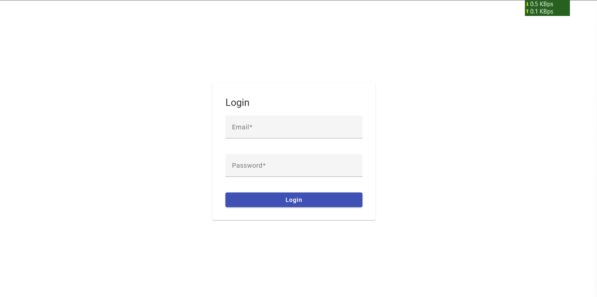
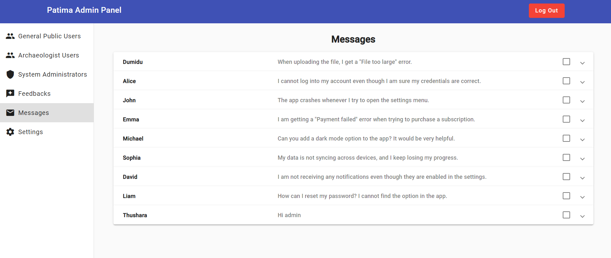
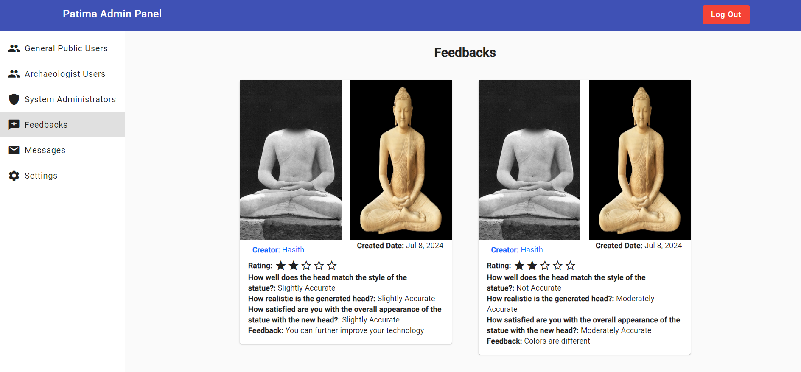
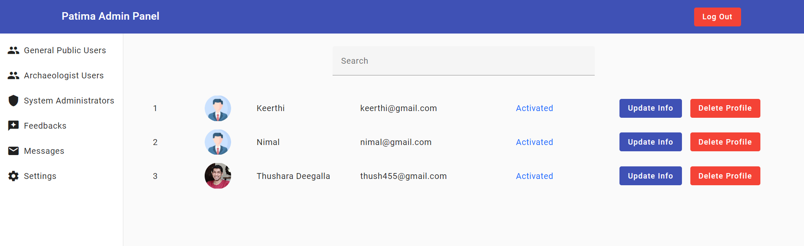

# Patima Admin Panel

## Overview

The Patima Admin Panel is a web-based application built using Angular 17 with Angular Material. This admin panel allows administrators to manage users, view and filter user accounts, update and delete user accounts, view messages, and review user feedback.

## Features

- **View Users**: Display a list of all users.
- **Filter Users**: Apply filters to search and sort through user accounts.
- **Update User Accounts**: Modify user account details.
- **Delete User Accounts**: Remove user accounts from the system.
- **View Messages**: Access and read messages sent by users.
- **View Feedback**: Review feedback provided by users.

## Technologies Used

- **Angular 17**: A platform and framework for building single-page client applications using HTML and TypeScript.
- **Angular Material**: A UI component library for Angular developers.
- **Nginx**: A high-performance HTTP server and reverse proxy used to serve the application.
- **Docker**: A platform for developing, shipping, and running applications in containers.

## Usage

### Viewing Users

- Navigate to the Users section.
- Use the search and filter options to find specific users.
- Click on a user to view detailed information.

### Updating User Accounts

- Select a user from the list.
- Click the "Edit" button.
- Modify the user details in the form.
- Click "Save" to update the account information.

### Deleting User Accounts

- Select a user from the list.
- Click the "Delete" button.
- Confirm the deletion in the prompt.

### Viewing Messages

- Navigate to the Messages section.
- Browse through the list of messages.
- Click on a message to read its content.

### Viewing Feedback

- Navigate to the Feedback section.
- Review the list of feedback entries.
- Click on an entry to view detailed feedback.

## Sample Images

<div align="center">
    
    
    
</div>
<div align="center">
    
</div>

## Contributing

We welcome contributions to the Patima Admin Panel. Please follow these steps to contribute:

1. **Fork the repository**:
    ```bash
    git fork https://github.com/DumiduPramith/OnesandZeros-patima-admin-panel-angular.git
    ```

2. **Create a new branch**:
    ```bash
    git checkout -b feature/your-feature-name
    ```

3. **Make your changes and commit them**:
    ```bash
    git commit -m "Add your commit message here"
    ```

4. **Push to the branch**:
    ```bash
    git push origin feature/your-feature-name
    ```

5. **Create a pull request**: Describe your changes and submit the pull request.


## Contact

For any inquiries or issues, please contact us at dumidu42@gmail.com.
